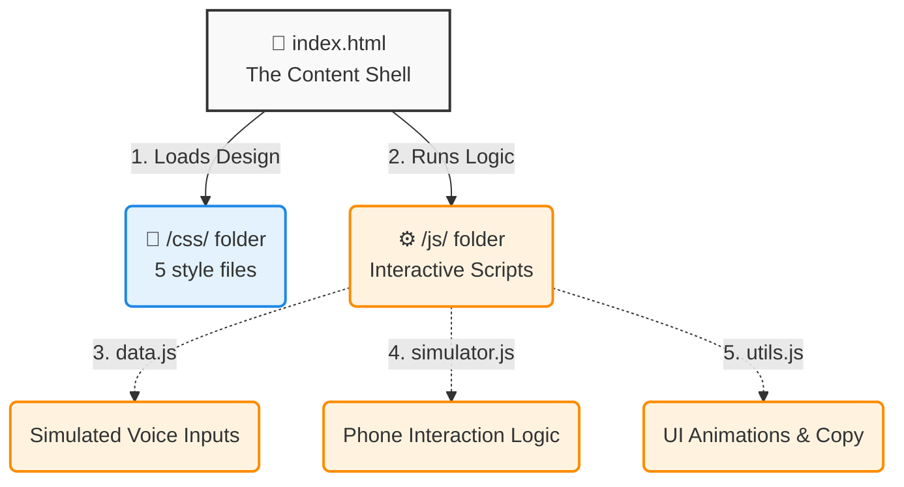

<div align="center">
  
  <h1>CivicFlow AI Web Demo</h1>
  <p><strong>A Bangla, English, and Banglish voice-first civic safety assistant for Bangladesh.</strong></p>
  <p><i>Proudly built by <b>Team Dreams of X</b> for the CloudCamp 2026 Hackathon</i></p>
</div>

<br />

## About the Project

This repository contains the official interactive web demonstration for **CivicFlow AI**. While our primary product is a native Flutter Android application, this web portal serves as an easily accessible, live sandbox for hackathon judges to experience the core voice-to-action workflows without needing to install an APK.

The demo simulates our Gemini AI integration, showing how it processes natural voice commands to instantly route users to emergency services, check risk zones, or submit GPS-tagged reports to a secure dashboard.

## Features Demonstrated

- **Voice Command Simulation:** Experience how the AI parses intent from natural Bangla phrases (e.g., *“আমি বিপদে আছি, সাহায্য লাগবে”*).
- **Risk-Zone Monitor:** Preview the safety mechanisms that check user GPS locations against known hotspot datasets.
- **Smart Routing:** See how the system dynamically decides whether to silently submit a report, or simply provide a public utility helpline number.
- **Native App Mirroring:** A 1:1 CSS replica of our mobile interface.

## Technical Architecture & File Structure

This project is built using a **100% Vanilla Tech Stack** to ensure blazing-fast performance and zero-dependency deployments. There is no `npm`, no bundler (Webpack/Vite), and no frontend framework (React/Next.js).

### How the Code is Connected

Here is a visual map of how the website works. Even if you don't know how to code, this shows how the pieces snap together:



#### 1. The Core File (`index.html`)
The main `index.html` file is a monolithic document that contains the complete HTML structure of the entire landing page, including the mobile simulator UI and all feature sections.

#### 2. Modular CSS (`/css/`)
Because we aren't using a preprocessor like SCSS, the CSS is modularized natively by importing multiple files sequentially in the `<head>` of `index.html`. 
- **`variables.css`**: Defines all colors, fonts, and shadow tokens.
- **`layout.css`**: Defines the grid, container widths, and generic page structure.
- **`components.css`**: Defines reusable UI elements like buttons, inputs, and the mobile phone dialer.
- **`sections.css`**: Defines the specific styling for the hero, features, and dashboard sections.
- **`responsive.css`**: Contains media queries for mobile/tablet scaling.
*Note: Because they are loaded in this exact order, the browser naturally cascades the styles correctly.*

#### 3. The JavaScript Engine (`/js/`)
The Javascript handles the interactive logic, separated into clean, logical files.
- **`data.js`**: A static dictionary holding the simulated voice scenarios (Rab, Blood Bank, Emergency).
- **`simulator.js`**: Handles the mobile phone mockups, executing the typing animations, parsing the voice logic, and triggering the call workflows.
- **`utils.js`**: Manages global UI elements like the "Copy Password" button and scroll-triggered animations.

## How to Run Locally

Because this project is built entirely with pure static Vanilla HTML/CSS/JS, there is absolutely zero setup required.

To run it locally:
1. Clone the repository:
   ```bash
   git clone https://github.com/SanjanaPushpita/civicflow-demo-portal.git
   ```
2. Simply double-click `index.html` to open it in your browser!
3. Alternatively, you can use any local web server (like VS Code Live Server).

## Important Links
- **Interactive Web Demo:** [Live on Vercel](https://civicflow-demo-portal.vercel.app/)
- **Main Flutter Source Code:** [GitHub Repository](https://github.com/SanjanaPushpita/civicflow-ai)
- **Backend Dashboard:** [Live Render App](https://civicflow-ai-backend.onrender.com/dashboard/reports)

---

<div align="center">
  <p>&copy; 2026 Team Dreams of X. All rights reserved.</p>
</div>
